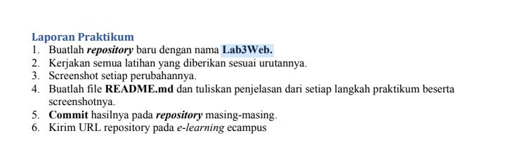
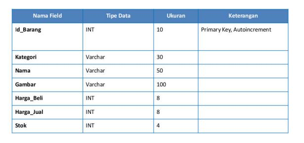
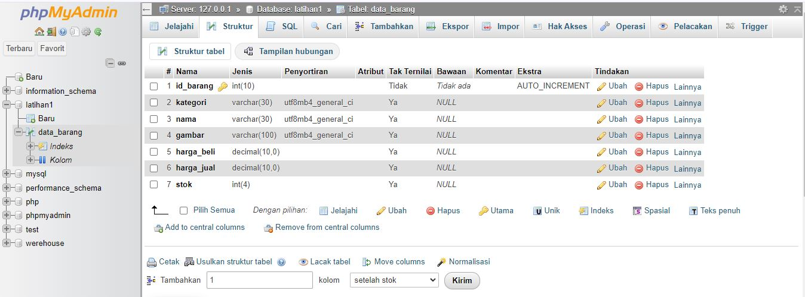
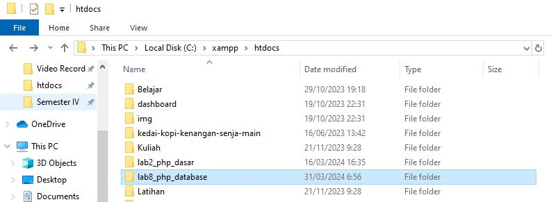
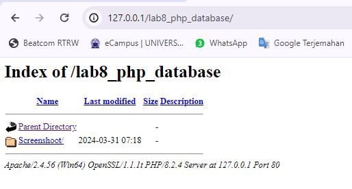
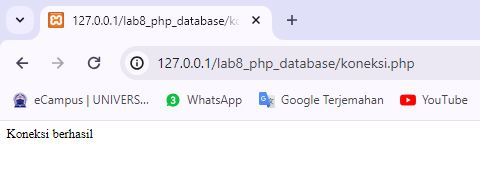

```py
Nama  : Muhamad Ali M
Nim   : 312210540
Kelas : TI.22.B2
```

# TUGAS



# Membuat Database: Studi Kasus Data Barang



# Membuat Database

CREATE DATABASE latihan1;

Membuat Tabel

```py
CREATE TABLE data_barang (
id_barang int(10) auto_increment Primary Key,
kategori varchar(30),
nama varchar(30),
gambar varchar(100),
harga_beli decimal(10,0),
harga_jual decimal(10,0),
stok int(4)
);
```



# Menambahkan Data

```py
INSERT INTO data_barang (kategori, nama, gambar, harga_beli, harga_jual,
stok)
VALUES ('Elektronik', 'HP Samsung Android', 'hp_samsung.jpg', 2000000,
2400000, 5),
('Elektronik', 'HP Xiaomi Android', 'hp_xiaomi.jpg', 1000000, 1400000, 5),
('Elektronik', 'HP OPPO Android', 'hp_oppo.jpg', 1800000, 2300000, 5);
```


# Membuat Program CRUD

Buat folder lab8_php_database pada root directory web server (d:\xampp\htdocs)



Kemudian untuk mengakses direktory tersebut pada web server dengan mengakses URL:

http://localhost/lab8_php_database/ atau bisa juga dengan akses http://127.0.0.1/lab8_php_database/



# Membuat file koneksi database

Buat file baru dengan nama koneksi.php

```py
<?php
$host = "localhost";
$user = "root";
$pass = "";
$db = "latihan1";
$conn = mysqli_connect($host, $user, $pass, $db);
if ($conn == false)
{
echo "Koneksi ke server gagal. ";
die();
}
else echo "Koneksi berhasil";
?>
```

Buka melalui browser untuk menguji koneksi database (untuk menyampilkan pesan koneksi berhasil,

uncomment pada perintah echo “koneksi berhasil”;


